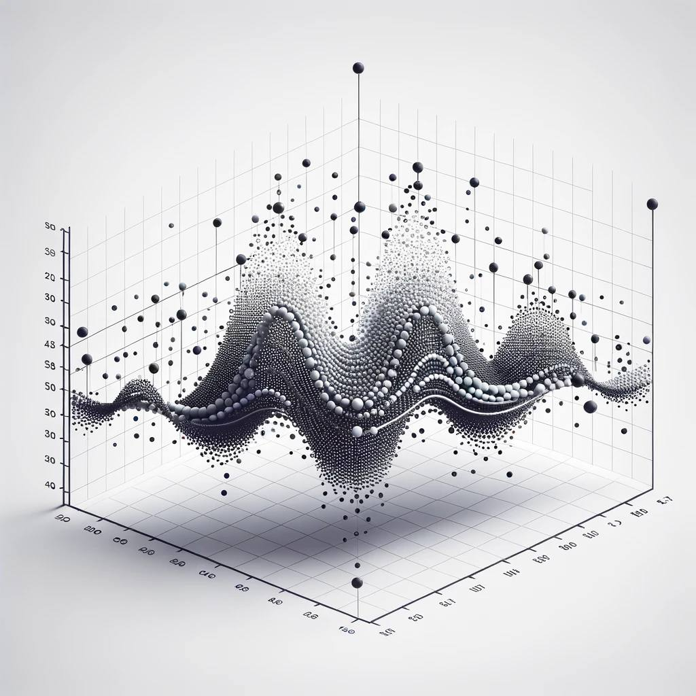
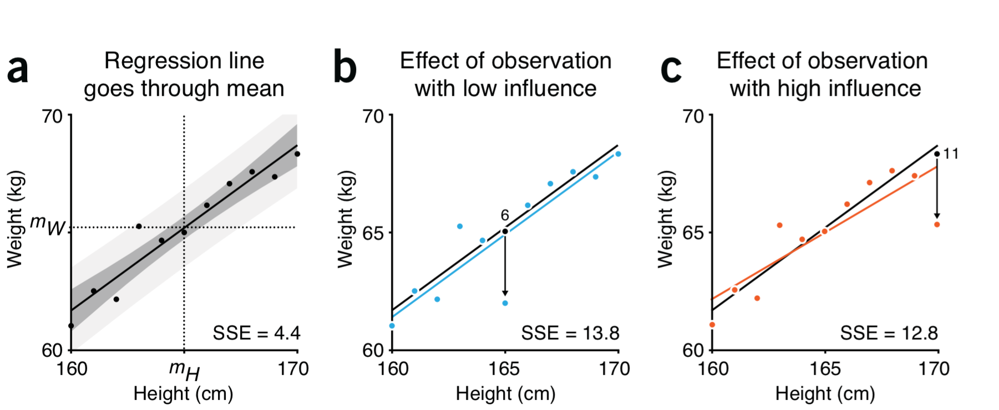
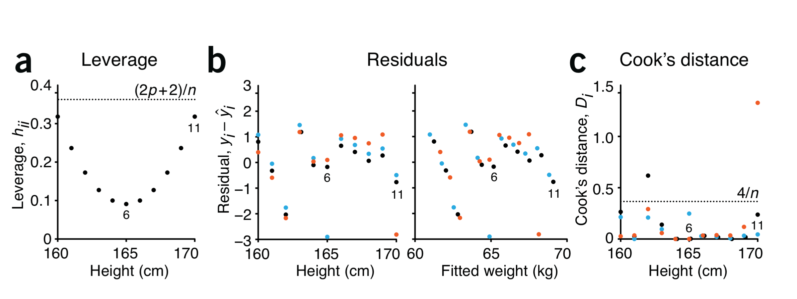
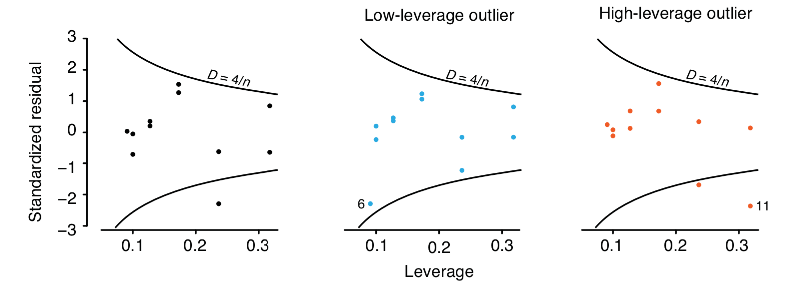
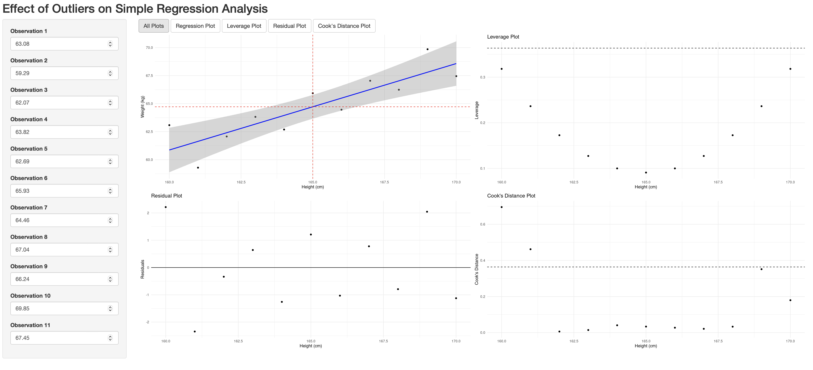

<!-- Custom Cover Page -->

  
<h1>Understanding the Impact of Outliers in Data Analysis</h1>

  
<h3>Based on a Paper Written By N. Altman and M. Krzywinski</h3>

  
  

Par Pishrobat

  

`r Sys.Date()`

# Introduction to Outliers 

- **Outliers:** Data points that stand out dramatically from others
- **Importance:** Identifying outliers is crucial for accurate and reliable data analysis
- **Our Focus:** Understanding the role of outliers in regression, a common statistical analysis method

# Why Should We Care About Outliers?

- **Influence on Analysis:** A single outlier can significantly skew our findings
- **Insight or Distraction:** Outliers might reveal important insights or mislead us
- **Objective:** Aim for precise interpretations and predictions by managing outliers thoughtfully

# Spotting the Unusual

- **Leverage:** How much an outlier could *potentially* sway our analysis
- **Influence:** Not all outliers affect the analysis equally
- **Example:** How outliers can affect the slope of a regression line

# Regression Analysis Framework

- **Regression Model:** Defines the relationship between a predictor and response
$$
Y = \beta_0 + \beta_1 X + \epsilon
$$
- **Fitted Model:** Estimated model parameters based on given data
$$
\text{Weight} = -45 + 0.66 \cdot\text{Height} + \epsilon
$$
- **Model Interpretation:** How changes in Height predict changes in Weight
- **Outlier Effects:** How outliers influence the regression slope

# Effects of Outliers on Regression Slope

- **Central Trend:** Regression line passes through data means
- **Low Influence:** Point 6 slightly adjusts the line, larger SSE
- **High Influence:** Point 11 shifts the line's slope, smaller SSE
- **Leverage Effect:** Outliers' positions relative to the mean distorts the analysis

    
    
Figure 1: 

# Leverage: The Power to Influence 

- **Definition:** Measure of an outlier's potential impact
- **Proximity to Mean:** Points further from the average carry more leverage
- **Social Analogy:** How individual preferences can sway a group decision
- **Physical Analogy:** In a seesaw, force applied farther from the pivot has more impact

    

# Residuals and Cook's Distance 

- **Residuals:** The gaps between what we predict and what we observe
- **Cook's Distance:** Gauging the change in model predictions without a specific data point
- **Overall Influence** Cook's Distance quantifies the *actual* influence of a data point
- **Model Sensitivity** Reflects the model's responsiveness to outlier

# Evaluating Outlier Influence

    

# Residuals vs Leverage

- **Influence Curves** Curved lines represent Cook's distance thresholds
- **Standard Residuals** Vertical distance from zero indicates the size of their residuals
- **Outlier Identification** Points above the curve are potential outliers with high influence
- **Low-Leverage Outliers** Blue points show outliers with small leverage but significant residuals
- **High-Leverage Outliers** Red points indicate outliers with both high leverage and large residuals

    

# Visualizing the Effects

- **Visualization:** How adding/removing outliers affects the regression line
- Access the visual demonstrations [here](https://wymo76-par-pishrobat.shinyapps.io/outliers/).

    

# What to Do with Outliers 

- **Decision:** Whether to keep or remove outliers
- **Caution:** Removing outliers simplifies the model but may oversimplify reality
- **Considerations:** Always evaluate the source and context of outliers

# Conclusion 

- **Critical Role:** Outliers play a pivotal role in statistical analyses
- **Opportunity:** Not merely errors to discard but potential sources of deeper understanding
- **Insight:** Thoughtful outlier analysis fosters more reliable and robust models

# References 

- Naomi Altman & Martin Krzywinski, "Analyzing outliers: influential or nuisance?", *Nature Methods*, 2016.
- The [app](https://wymo76-par-pishrobat.shinyapps.io/outliers/) is written by Par Pishrobat and hosted on www.shinyapps.io platform for public use.

